# RemoteCLIP: A Vision Language Foundation Model for Remote Sensing 中文精读译注

> 原文 PDF: `papers/RemoteCLIP_arXiv_2306.11029.pdf`  
> 论文: Fan Liu, Delong Chen, Zhangqingyun Guan, Xiaocong Zhou, Jiale Zhu, Qiaolin Ye, Liyong Fu, Jun Zhou, "RemoteCLIP: A Vision Language Foundation Model for Remote Sensing", arXiv:2306.11029v4, 2024-04-16.  
> 说明: 本文档是面向论文阅读和 RS-Token 写作的中文精读译注。原论文 arXiv 页面标注为 CC BY 4.0，本文在保留署名、原文链接和许可说明的前提下嵌入 Fig. 1-10 与 Table I-V 的原图表裁剪图；中文部分为转述和解读，并非逐字全译。
>
> License: 原论文图表来自 RemoteCLIP, arXiv:2306.11029v4, licensed under CC BY 4.0. 本文档对图表进行了页面裁剪和中文说明整理。

## 0. 一句话总结

RemoteCLIP 的核心思想是: 保留 CLIP 的图像编码器、文本编码器和图文对比学习框架，但把训练数据换成大规模遥感图像-文本对，从而得到一个更懂遥感场景、可做图文检索、zero-shot 分类、few-shot 分类、linear probe、k-NN 分类和目标计数的视觉-语言基础模型。

这篇文章最大的贡献不是提出一个全新的网络结构，而是提出了一套遥感数据扩展方法: 把已有的遥感检测框、语义分割 mask 和图文检索数据统一转成 image-caption 格式，再用 CLIP 式 InfoNCE 对比学习继续预训练。

## 1. 研究背景和问题

遥感领域已经有不少 foundation model，例如 SatMAE、Scale-MAE、RingMo、ViTAE、Billion-scale MAE 等。这类方法多基于自监督学习或 Masked Image Modeling，优点是能从大量遥感图像中学视觉特征，缺点是缺少语言理解和图文对齐能力。

作者认为，这些 MIM/SSL 遥感基础模型有两个主要限制:

1. 它们主要学习图像内部的视觉表示，不能像 CLIP 那样直接做图文检索或 zero-shot 任务。
2. 它们更偏低层或中层视觉特征，对高层语义识别、few-shot 学习和开放词汇任务不够友好。

OpenAI CLIP 虽然可以把图像和文本对齐到同一个 embedding 空间，但它主要来自自然图像互联网图文对，直接迁移到遥感场景时会遇到领域差异。论文的目标就是构建一个遥感领域的 CLIP: RemoteCLIP。

## 2. 论文核心思路

RemoteCLIP 沿用 CLIP 的基本训练范式:

```text
图像 x_I -> 图像编码器 f_I -> 图像 embedding z_I
文本 x_T -> 文本编码器 f_T -> 文本 embedding z_T
匹配图文对拉近，不匹配图文对拉远
```

训练目标仍是 InfoNCE 对比学习损失。图像编码器可以是 ResNet-50、ViT-B-32 或 ViT-L-14；文本编码器是 Transformer，最大 token 长度与 CLIP 相同，为 77。

真正的难点是: 遥感领域没有足够大的 image-caption 数据集。已有 RSICD、RSITMD、UCM 这类遥感图文检索数据总量只有约 13k 图像，直接拿来继续训练大 CLIP 会过拟合。因此作者提出数据扩展方案，把不同类型的遥感标注统一变成 caption。

## 3. 数据构造方法

论文把训练数据分成三类:

| 类别 | 含义 | 作用 |
|---|---|---|
| RET-3 | 已有人类 caption 的遥感图文检索数据，包括 RSICD、RSITMD、UCM | 提供高质量但小规模的图文对 |
| DET-10 | 遥感/无人机目标检测数据，有 bounding box 和类别名 | 通过 B2C 生成 caption，是扩展数据的主要来源 |
| SEG-4 | 遥感语义分割数据，有 mask | 先 M2B 转成框，再 B2C 转成 caption |

### 3.1 B2C: Box-to-Caption

B2C 的作用是把检测框和类别名转换成自然语言描述。每张图生成 5 条 caption。前两条关注目标位置，例如中心区域目标和非中心区域目标；后三条关注图中类别数量和目标种类。

论文图中出现的 caption 示例包括:

```text
Lots of airplanes are located in the picture.
There are 15 aircrafts on the ground.
An airplane in the middle of the picture.
A ship in the middle of the picture.
A crowd of cars are located in this remote sensing picture.
There are 3 cars in the picture.
White buildings and tennis courts are beside the gray road.
Some planes are parked in an airport near a piece of green trees.
```

这些句子并不一定语法完美，因为很多是规则生成的，但它们足以把图像中的目标、数量和位置关系传递给文本编码器。

### 3.2 M2B: Mask-to-Box

M2B 的作用是把语义分割 mask 转换成 bounding box。流程大致是:

1. 按类别把 segmentation mask 二值化。
2. 对每个类别区域做轮廓提取。
3. 找出连通区域轮廓的最小和最大横纵坐标。
4. 用这些坐标生成水平 bounding box。
5. 再把生成的 box 输入 B2C，得到 caption。

### 3.3 数据规模

最终训练集包含:

| 项目 | 数量 |
|---|---:|
| 图像数 | 165,745 |
| 每张图 caption 数 | 5 |
| 图文对数量 | 828,725 |

作者强调，这比原有遥感 image-caption 数据规模大约扩大到 12 倍。

## 4. 模型训练

RemoteCLIP 是在已有 CLIP 权重基础上做 continual pretraining。论文训练了三个尺度:

| 视觉 backbone | 参数规模定位 | 说明 |
|---|---|---|
| ResNet-50 | 小规模 | CNN 视觉编码器 |
| ViT-B-32 | 中等规模 | Vision Transformer Base，patch size 为 32 |
| ViT-L-14 | 大规模 | Vision Transformer Large，patch size 为 14 |

训练时使用标准图像增强，包括随机裁剪、水平翻转，以及 0、90、180、270 度随机旋转，以适配遥感图像方向不固定的特点。

## 5. 实验任务

论文在 16 个数据集上评估 RemoteCLIP，任务包括:

| 任务 | 说明 |
|---|---|
| Cross-modal retrieval | 图到文检索和文到图检索 |
| Zero-shot image classification | 用文本模板直接分类，无需训练分类头 |
| Few-shot classification | 少量样本训练线性层 |
| Full-shot linear probing | 冻结图像特征，训练线性分类器 |
| k-NN classification | 用图像 embedding 做近邻分类 |
| Object counting | 判断图中目标数量 |
| Similarity visualization | 看文本类别和图像 patch 的相似度热图 |

Zero-shot 分类使用的文本模板是:

```text
a satellite photo of {class name}.
```

例如:

```text
a satellite photo of airport.
a satellite photo of harbor.
a satellite photo of residential area.
```

## 6. 主要实验结论

### 6.1 图文检索

作者首先证明 OpenAI CLIP 本身在遥感图文检索上已经很强，尤其大模型 CLIP 在 RET-3 检索数据上能超过不少专门为遥感检索设计的模型。

但仅用 RET-3 做 continual pretraining 会遇到数据太少的问题。RemoteCLIP 通过 DET-10 和 SEG-4 扩展数据后，在 RSITMD、RSICD、UCM 等检索基准上进一步提升。摘要中特别强调:

| 数据集 | RemoteCLIP 相对 previous SOTA 的提升 |
|---|---:|
| RSITMD | +9.14 mean recall |
| RSICD | +8.92 mean recall |

### 6.2 Zero-shot 分类

RemoteCLIP 在 12 个遥感分类数据集上总体优于 OpenAI CLIP。平均提升如下:

| Backbone | RemoteCLIP 相比 CLIP 的平均 zero-shot accuracy 提升 |
|---|---:|
| ResNet-50 | +2.85 pp |
| ViT-B-32 | +6.39 pp |
| ViT-L-14 | +5.63 pp |

但论文也诚实指出，RemoteCLIP 并非每个数据集都更好。例如某些低分辨率数据集，如 EuroSAT，可能因为分辨率分布和训练数据不同，RemoteCLIP 不一定优于 CLIP。

### 6.3 Few-shot 分类

作者测试 1、4、8、16、32-shot 设置。结论是: 只要给少量训练样本，RemoteCLIP 的特征就能快速适配具体遥感分类数据集。32-shot 设置下，RemoteCLIP 在 12 个分类数据集上均超过对比模型。

### 6.4 Linear probing 和 k-NN

RemoteCLIP 在传统图像特征评估上也优于 CLIP 和若干自监督模型。以 ViT-B-32 为例:

| 模型 | Linear 平均准确率 | k-NN 平均准确率 |
|---|---:|---:|
| CLIP ViT-B-32 | 92.31 | 92.15 |
| RemoteCLIP ViT-B-32 | 93.93 | 93.77 |

这说明 RemoteCLIP 不只是图文检索更好，它的图像 embedding 本身也更适合遥感分类。

### 6.5 Object Counting

作者构造了 RemoteCount 数据集，测试模型能不能从文本候选中选出图中目标数量。做法是把 caption 中的数量替换成 1 到 10 的候选，然后比较图像和候选文本的相似度，最高者作为预测数量。

结果显示 CLIP 在遥感计数上较弱，而 RemoteCLIP 有更明显的对角线混淆矩阵和更高 top-k accuracy。这说明遥感领域预训练不仅改善类别语义，也增强了数量相关的细粒度图文理解。

### 6.6 特征可视化

论文把遥感大图切成小 patch，并用文本查询类别计算相似度，例如:

```text
a building
a tree
a low vegetation
a plane
a harbor
```

相比原始 CLIP，RemoteCLIP 的相似度热图更接近真实 mask。这说明 RemoteCLIP 对遥感对象的空间位置和类别语义有更好的对齐能力。

## 7. Ablation Study

论文做了多组消融:

| 消融项 | 结论 |
|---|---|
| 预训练方式 | CLIP 初始化比 ImageNet 或 SSL 初始化更适合图文对齐 |
| 图像/文本 backbone 是否预训练 | 图像和文本 backbone 都预训练效果最好，其中图像 backbone 的预训练更关键 |
| 数据组合 | RET-3 + DET-10 + SEG-4 整体最好，说明检测和分割数据转 caption 是有效的 |
| 图像预处理 | 遥感旋转增强有助于检索任务 |
| 损失函数 | InfoNCE 在检索和 zero-shot 上整体表现最好 |

作者将这些结果解释为一个数据中心结论: 对遥感视觉-语言模型而言，扩大高质量图文对比学习数据比复杂化模型结构更关键。

## 8. 局限性

论文自己承认了几个限制:

1. 模型规模仍可继续扩大。最大 RemoteCLIP 是 ViT-L-14，但遥感领域已有更大规模视觉模型。
2. 数据规模仍不够。虽然已扩大到 165,745 张图，但相比通用 CLIP 的数亿级图文对仍很小。
3. B2C/M2B 规则生成 caption 的多样性有限。未来可以用生成式语言模型生成更丰富的描述。
4. 当前主要处理 RGB 图像，未来可以扩展到更多遥感模态。

## 9. 对 RS-Token 的意义

对我们的 RS-Token 来说，RemoteCLIP 提供的是一个遥感语义 teacher。它的价值不是直接作为分类器，而是提供一个更符合遥感场景的图像 embedding 空间。

在 RS-Token 训练中:

```text
原图 x -> frozen RemoteCLIP-ViT-B/32 -> 512 维 teacher embedding t
L0 量化特征 -> DistillHead -> 512 维 student embedding s
s 与 t 做 cosine alignment
```

因此，我们用 RemoteCLIP 蒸馏 L0 codebook 的逻辑是:

1. RemoteCLIP 已经通过遥感图文对学习了地物语义。
2. 它的 embedding 空间比通用 OpenAI CLIP 更贴近机场、港口、船舶、农田、住宅区等遥感类别。
3. 把 L0 对齐到 RemoteCLIP embedding，可以让第一层离散 token 更偏向承载地物身份。
4. 在信道受扰动时，L0 的语义结构更稳定，因此中等 SNR 下任务准确率更高。

不过也要诚实表述: 我们的实验 6 显示 OpenAI CLIP 也能蒸出大部分 L0 语义能力，RemoteCLIP 的主要额外价值体现在 degraded channel 下的 4-7 pp 鲁棒性提升，而不是 clean/no-channel 上限的大幅领先。

## 10. 完整图表索引

### Fig. 1: RET-3 图文检索平均召回率对比

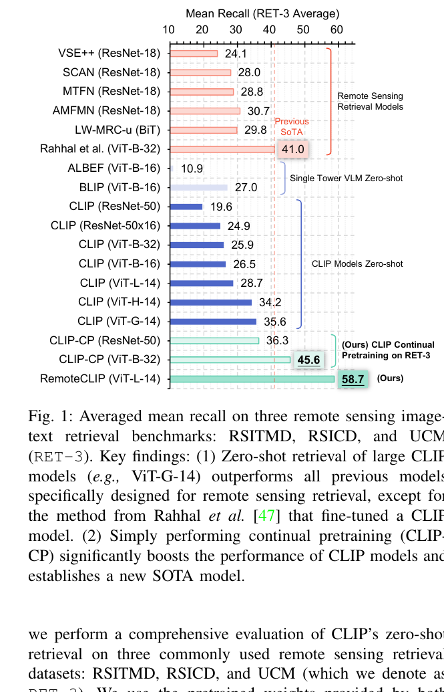

位置: PDF 第 4 页附近。

内容: 对比传统遥感检索模型、通用 CLIP、CLIP continual pretraining 和 RemoteCLIP 在 RSITMD、RSICD、UCM 三个图文检索数据集上的平均 mean recall。

要点: 大 CLIP 本身已有较强迁移能力；只用 RET-3 继续训练能提升；加入 DET-10 和 SEG-4 做数据扩展后，RemoteCLIP 进一步显著提升。

### Fig. 2: RemoteCLIP 总体流程

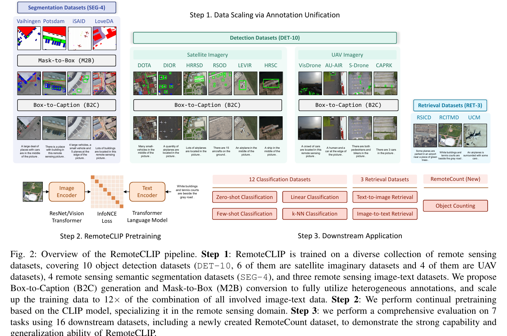

位置: PDF 第 5 页。

内容: 三步流程图。第一步把 SEG-4、DET-10、RET-3 统一成 image-caption 数据；第二步基于 CLIP 做 RemoteCLIP 预训练；第三步用于 zero-shot 分类、linear classification、图文检索、目标计数等下游任务。

要点: 这是全文最重要的方法图，展示了 M2B、B2C、图像编码器、文本编码器、InfoNCE loss 和下游任务的关系。

### Fig. 3: Mask-to-Box 实现示意

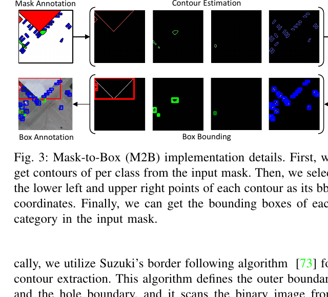

位置: PDF 第 6 页附近。

内容: 展示从 segmentation mask 到 contour estimation，再到 box annotation 和 box bounding 的过程。

要点: SEG-4 数据本来没有 caption，也没有检测框；M2B 让分割数据可以进入 B2C caption 生成流程。

### Fig. 4: Caption 长度分布

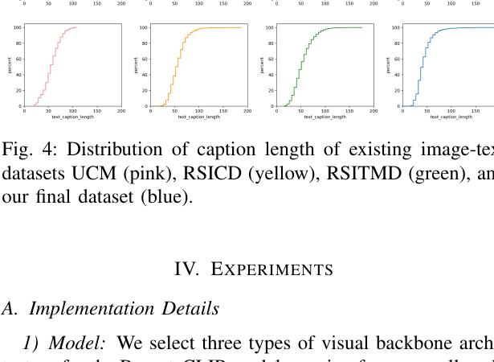

位置: PDF 第 7 页附近。

内容: 比较已有遥感图文数据和最终扩展数据的 caption 长度分布。

要点: B2C/M2B 生成的 caption 长度分布接近原有人工 caption 数据，说明规则生成文本在长度层面没有明显偏离。

### Fig. 5: Caption 词云和高频词

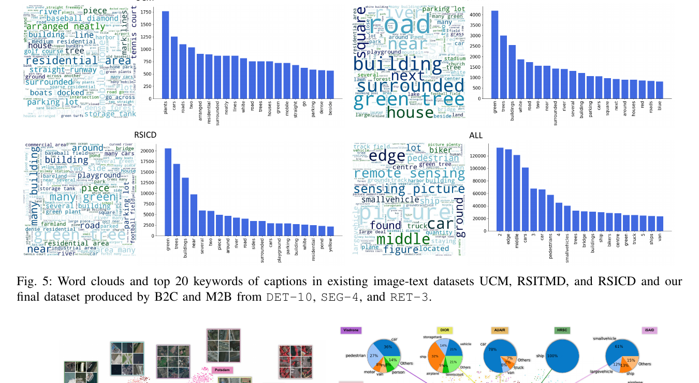

位置: PDF 第 8 页附近。

内容: 展示 UCM、RSITMD、RSICD 和最终数据集的词云及前 20 高频词。

要点: 最终数据集包含更多遥感目标词，例如 airplane、ship、building、road、vehicle 等，语义覆盖更丰富。

### Fig. 6: 图像和文本样本的 t-SNE 可视化

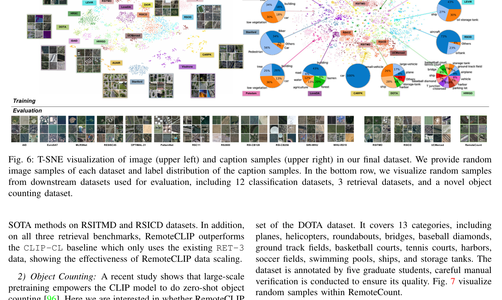

位置: PDF 第 8 页附近。

内容: 上半部分展示训练数据中图像样本和 caption 样本的 t-SNE 分布；下半部分展示下游评估数据集样本，包括 12 个分类数据集、3 个检索数据集和 RemoteCount。

要点: 数据扩展后样本分布更丰富，覆盖不同遥感来源和任务分布。

### Fig. 7: RemoteCount 样本示例

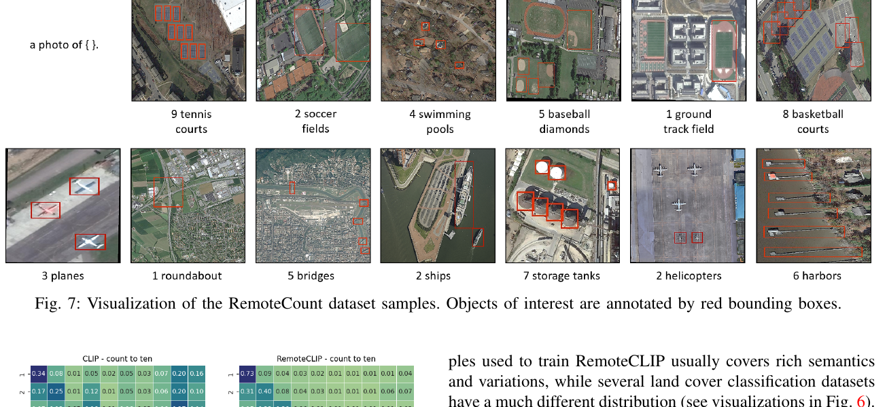

位置: PDF 第 10 页附近。

内容: 展示 RemoteCount 中的遥感图像样本，并用红色框标出感兴趣目标。

要点: RemoteCount 用于测试遥感场景下的 zero-shot object counting。

### Fig. 8: CLIP 与 RemoteCLIP 的目标计数实验

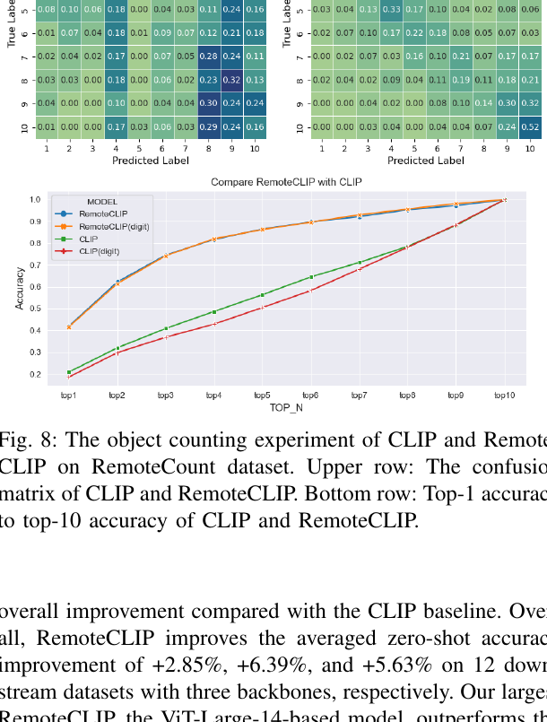

位置: PDF 第 10 页附近。

内容: 上方是 CLIP 和 RemoteCLIP 的计数混淆矩阵，下方是 top-1 到 top-10 accuracy。

要点: RemoteCLIP 的混淆矩阵更接近对角线，说明它更能区分遥感图像中的目标数量。

### Fig. 9: 12 个遥感分类数据集上的 few-shot 结果

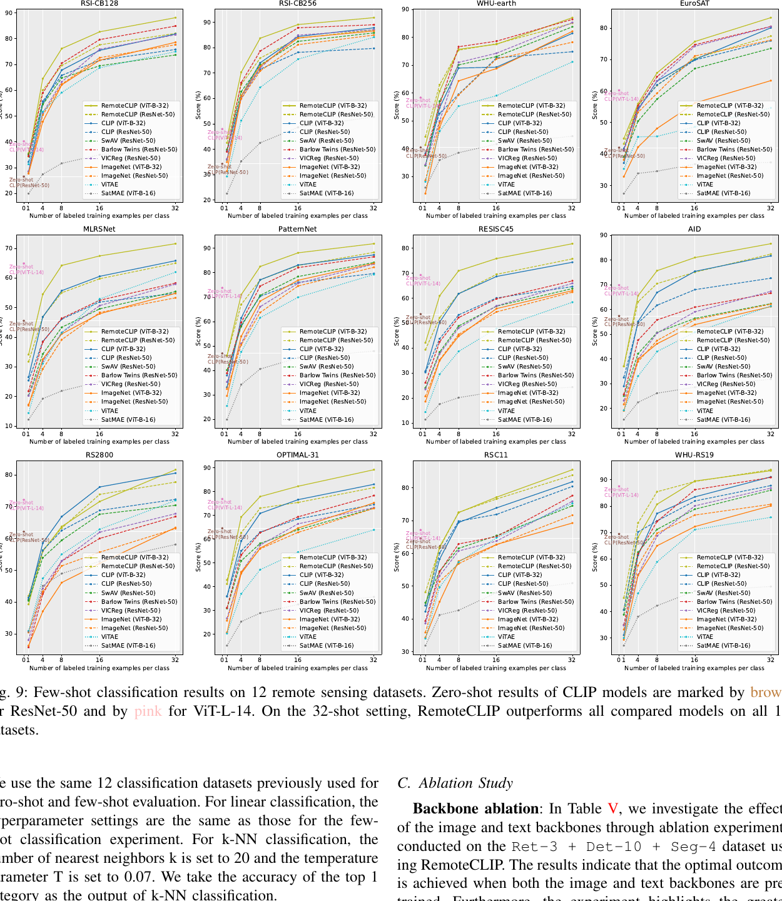

位置: PDF 第 11 页附近。

内容: 展示 1、4、8、16、32-shot 设置下不同模型在 12 个数据集上的表现。

要点: RemoteCLIP 在少样本场景中适配能力强，32-shot 下超过所有对比模型。

### Fig. 10: CLIP vs RemoteCLIP 相似度可视化

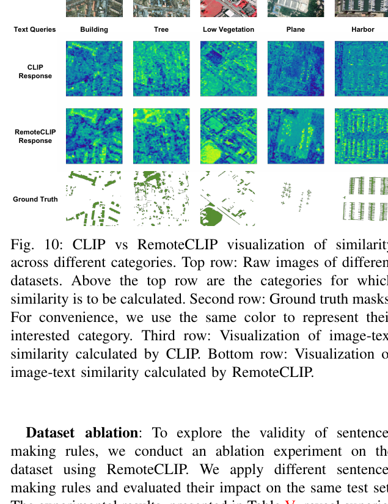

位置: PDF 第 12 页附近。

内容: 对 building、tree、low vegetation、plane、harbor 等文本查询，比较 CLIP 和 RemoteCLIP 在图像 patch 上的相似度响应，并与 ground-truth mask 对比。

要点: RemoteCLIP 的热图更接近真实目标区域，说明它学到了更强的遥感图文局部对齐能力。

### Table I: 数据集统计

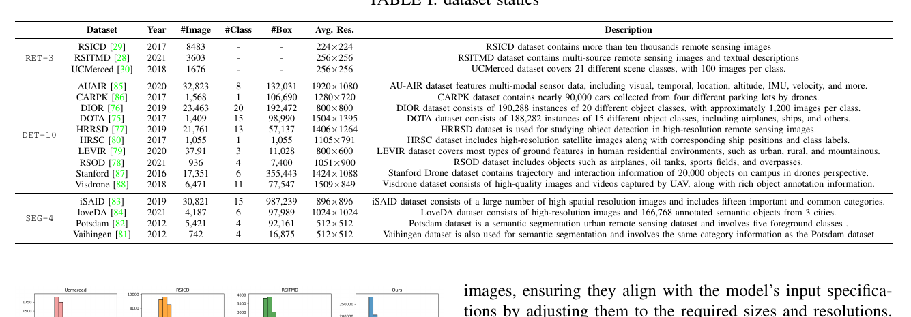

位置: PDF 第 7 页。

内容: 列出 RET-3、DET-10、SEG-4 中各数据集的年份、图像数量、类别数、框数量、平均分辨率和描述。

要点: DET-10 是扩展数据的主要来源；SEG-4 通过 M2B/B2C 也被纳入；最终形成比原始图文数据大得多的训练集。

### Table II: RSITMD、RSICD、UCM 图文检索结果

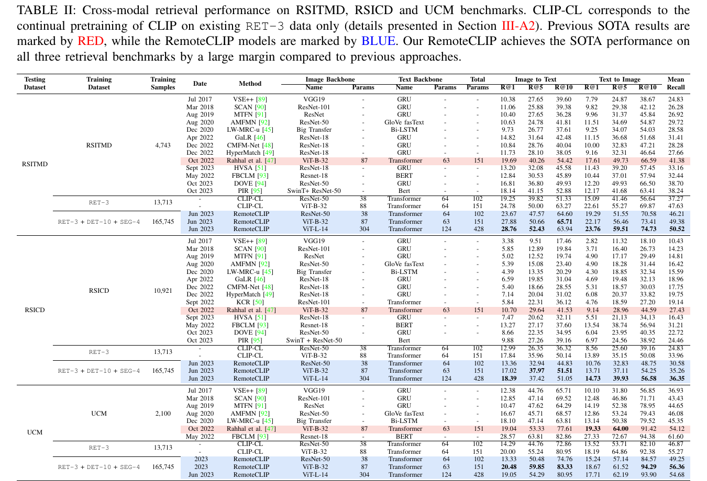

位置: PDF 第 9 页。

内容: 比较传统遥感检索模型、CLIP-CL 和 RemoteCLIP 在图到文、文到图检索上的 R@1、R@5、R@10 和 mean recall。

要点: RemoteCLIP 尤其在 RSITMD 和 RSICD 上相对 previous SOTA 有明显提升，证明数据扩展和遥感领域继续预训练有效。

### Table III: 12 个遥感分类数据集上的 zero-shot accuracy

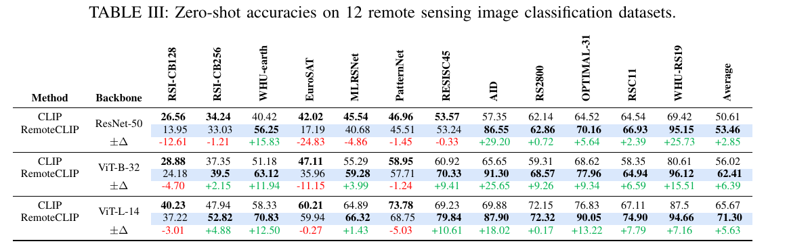

位置: PDF 第 9-10 页。

内容: 比较 CLIP 和 RemoteCLIP 在 ResNet-50、ViT-B-32、ViT-L-14 三种 backbone 下的 zero-shot 分类准确率。

要点: RemoteCLIP 平均优于 CLIP，ViT-B-32 上平均提升最大，为 6.39 pp；但个别数据集存在下降，说明域适配并非无条件提升所有分布。

### Table IV: Linear probing 和 k-NN 分类结果

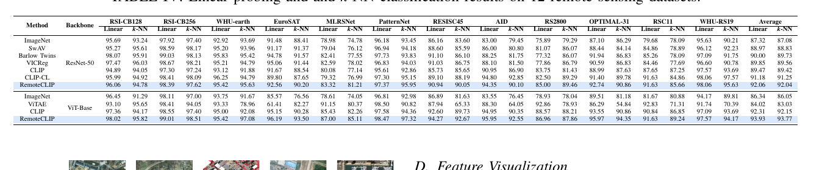

位置: PDF 第 12 页。

内容: 比较 ImageNet、SwAV、Barlow Twins、VICReg、CLIP、CLIP-CL、RemoteCLIP 等模型在 12 个遥感分类数据集上的 linear 和 k-NN 准确率。

要点: RemoteCLIP 的图像 embedding 本身质量更高，不只是图文检索更好。

### Table V: 消融实验

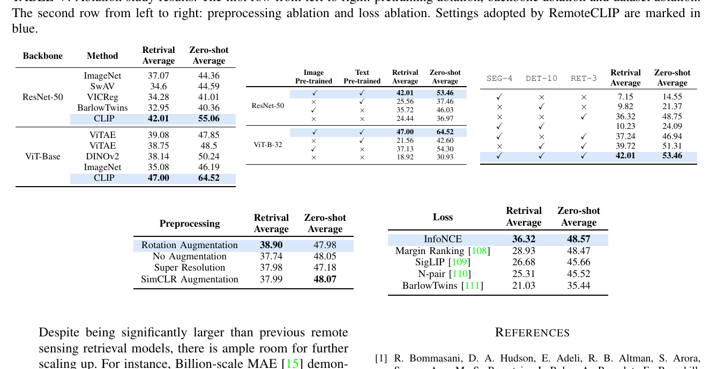

位置: PDF 第 13 页。

内容: 包含预训练消融、backbone 消融、数据集消融、预处理消融和损失函数消融。

要点: 最优配置依赖 CLIP 初始化、图像与文本 backbone 预训练、RET-3 + DET-10 + SEG-4 联合数据、旋转增强和 InfoNCE 损失。

## 11. 可用于论文写作的中文表述

RemoteCLIP 的主要贡献可以概括为:

> RemoteCLIP 将 CLIP 的视觉-语言对比学习框架迁移到遥感领域。由于遥感图文对稀缺，作者提出 B2C 和 M2B 两种规则转换策略，将目标检测框和语义分割 mask 统一转换为自然语言 caption，从而把训练数据扩展到 165,745 张图像和 828,725 个图文对。实验表明，RemoteCLIP 在遥感图文检索、zero-shot 分类、few-shot 分类、linear probing、k-NN 分类和目标计数任务上整体优于通用 CLIP，说明遥感领域图文预训练能够提供更强的地物语义先验。

对 RS-Token 的写法可以是:

> In RS-Token, RemoteCLIP is used only as a frozen training-time teacher. Its remote-sensing-specific image embedding space provides a semantic target for the first RVQ layer, encouraging L0 indices to encode land-cover identity rather than only reconstruction residuals. This role is different from using RemoteCLIP as a deployment classifier; after training, the communication system transmits only discrete RVQ indices and does not require RemoteCLIP at the receiver.
